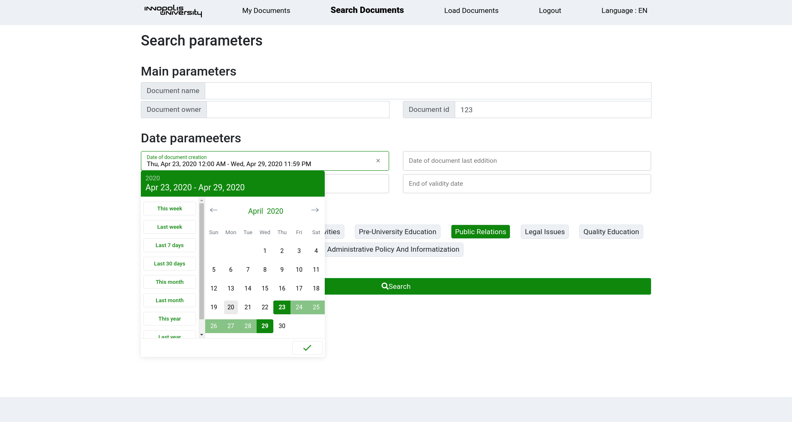
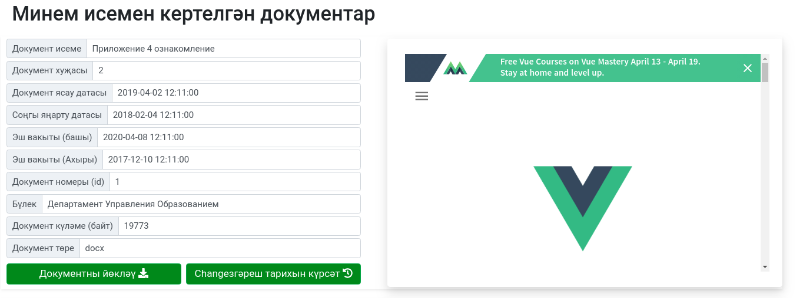
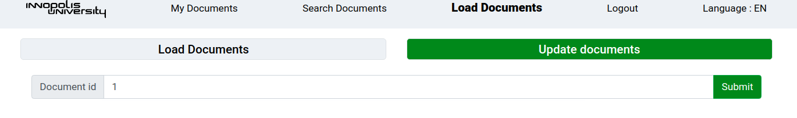
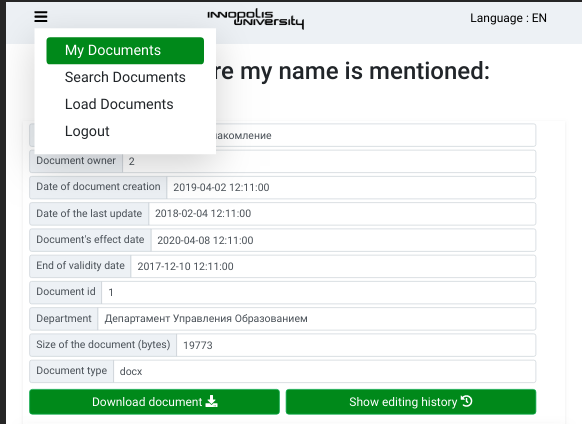
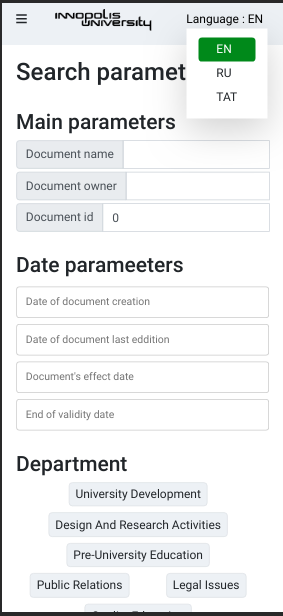

# Local Regulatory Documents Database

## Project for SP course

### How does it look like:

#### Gif:


#### Updates of sprint 3

##### Search interface changes



##### Document representation model



##### Load document interface



##### Mobile optimization

Tablet:



Phone:



### How to use frontend

#### CLI way

Open the derictory of the project via terminal, run `cd lrdb-front/`

Project setup

```
npm install
```

Compiles and hot-reloads for development

```
npm run serve
```

Compiles and minifies for production

```
npm run build
```

#### Test way (no npm required)

1. Change folder `cd ./lrdb-front/dist`
2. Up the tem server `python3 -m http.server`
3. Open `http://0.0.0.0:8000/` in browser

### Backend API

[Link](https://documenter.getpostman.com/view/10962051/SzYdRvWC)

## Authors

-   Alina Bogdanova
-   Gosha Stepanov
-   Pavel Tishkin
-   Yurii Zarubin
